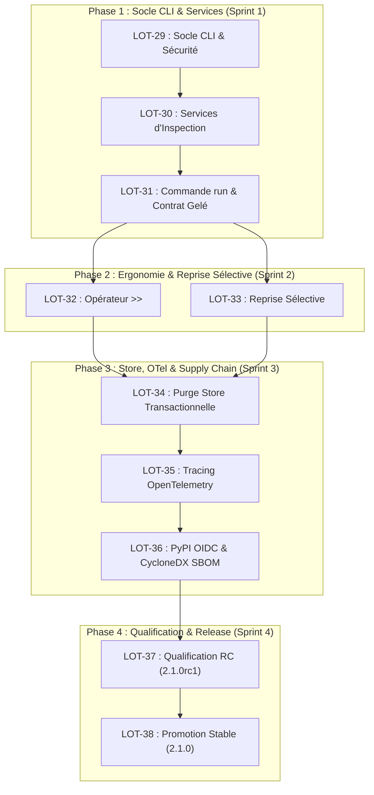

# Roadmap PyWorkflowKit

Ce document définit la trajectoire produit, technique et de livraison de **PyWorkflowKit**. Il formalise les versions supportées, les fonctionnalités en cours de développement et la planification des lots pour la version **2.1.0**.

---

## 1. Politique de Versionnement & Cycle de Vie

PyWorkflowKit respecte strictement le [Semantic Versioning (SemVer 2.0.0)](https://semver.org/) :

```text
pyworkflowkit
├── 2.0.x (Baseline Stable & LTS)
│   └── Correctifs de bugs, patchs de sécurité, zéro changement d'API.
│
├── 2.1.x (Feature Release — En Cours)
│   └── Évolutions additives 100% rétro-compatibles :
│       • CLI moderne et modulaire (standardisée sur pytransformkit)
│       • Syntaxe d'authoring fluide (opérateur >>)
│       • Reprise sélective au point d'échec (WorkflowRuntime.resume_run)
│       • Rétention et purge transactionnelle du store (pwk store prune)
│       • Observabilité distribuée OpenTelemetry & W3C TraceContext
│       • Supply chain durcie (OIDC PyPI, CycloneDX SBOM, Sigstore)
│
└── 3.0.0 (Horizon Majeur Futur)
    └── Retrait définitif des modules legacy V1 dépréciés.
```

---

## 2. Statut Actuel du Projet

- **Version Stable** : `2.0.0` (publiée et validée, CI multi-OS 100% verte).
- **Phase en cours** : Lancement de l'implémentation de la version **2.1.0**.
- **Conception & Plans** : 100% validés et formalisés dans [`docs/plans/`](docs/plans/).

---

## 3. Feuille de Route d'Implémentation 2.1.0

Le développement de la version 2.1.0 est structuré en **4 phases séquentielles** et **10 lots techniques** :



```text
┌────────────────────────────────────────────────────────────────────────┐
│ Phase 1 : Socle CLI & Services (Sprint 1)                              │
│                                                                        │
│   [LOT-29 : Socle CLI & Sécurité]                                      │
│                  │                                                     │
│                  ▼                                                     │
│   [LOT-30 : Services d'Inspection (validate, plan, inspect)]           │
│                  │                                                     │
│                  ▼                                                     │
│   [LOT-31 : Commande run, Simulation dry-run & Contrat Gelé]           │
└──────────────────┬─────────────────────────────────────────────────────┘
                   │
                   ├───────────────────────────────────┐
                   ▼                                   ▼
┌──────────────────────────────────────┐  ┌──────────────────────────────┐
│ [LOT-32 : Opérateur >> & Cycle Det.] │  │ [LOT-33 : Reprise Sélective] │
└──────────────────┬───────────────────┘  └────────────┬─────────────────┘
                   │                                   │
                   └─────────────────┬─────────────────┘
                                     │ (Phase 2 : Ergonomie & Reprise)
                                     ▼
┌────────────────────────────────────────────────────────────────────────┐
│ Phase 3 : Store, OTel & Supply Chain (Sprint 3)                        │
│                                                                        │
│   [LOT-34 : Purge Store Transactionnelle (pwk store prune)]            │
│                  │                                                     │
│                  ▼                                                     │
│   [LOT-35 : Tracing OpenTelemetry & Propagation W3C TRACEPARENT]       │
│                  │                                                     │
│                  ▼                                                     │
│   [LOT-36 : Supply Chain (PyPI OIDC, CycloneDX SBOM & Sigstore)]       │
└──────────────────┬─────────────────────────────────────────────────────┘
                   │
                   ▼
┌────────────────────────────────────────────────────────────────────────┐
│ Phase 4 : Qualification & Release (Sprint 4)                           │
│                                                                        │
│   [LOT-37 : Qualification Release Candidate 2.1.0rc1 (Multi-OS CI)]    │
│                  │                                                     │
│                  ▼                                                     │
│   [LOT-38 : Promotion Stable PyWorkflowKit 2.1.0 (Publication PyPI)]   │
└────────────────────────────────────────────────────────────────────────┘
```

### Détail des Phases et des Lots

| Phase | Lot | Intitulé & Périmètre | Document Cadre / Plan | Statut |
| :--- | :--- | :--- | :--- | :---: |
| **Phase 1** | **LOT-29** | Socle CLI, Sécurité des chemins, `pwk version` & `doctor` | [`01_PLAN_LOT29_CLI_FOUNDATIONS.md`](docs/plans/01_PLAN_LOT29_CLI_FOUNDATIONS.md) | ✅ Terminé (PR #110) |
| | **LOT-30** | Services d'inspection (`pwk validate`, `plan`, `inspect`) | [`02_PLAN_LOT30_CLI_INSPECTION_SERVICES.md`](docs/plans/02_PLAN_LOT30_CLI_INSPECTION_SERVICES.md) | ✅ Terminé (PR #111) |
| | **LOT-31** | Commande `pwk run` V2, simulation `--dry-run`, contrat JSON | [`03_PLAN_LOT31_CLI_RUN_AND_CONTRACT_FREEZE.md`](docs/plans/03_PLAN_LOT31_CLI_RUN_AND_CONTRACT_FREEZE.md) | ✅ Terminé (PR #112) |
| **Phase 2** | **LOT-32** | Ergonomie d'Authoring (`task_a >> task_b`), validation statique | [`04_PLAN_LOT32_AUTHORING_ERGONOMICS.md`](docs/plans/04_PLAN_LOT32_AUTHORING_ERGONOMICS.md) | ✅ Terminé (PR #113) |
| | **LOT-33** | Reprise sélective au point d'échec (`resume_run`) | [`05_PLAN_LOT33_SELECTIVE_RESUME.md`](docs/plans/05_PLAN_LOT33_SELECTIVE_RESUME.md) | ✅ Terminé (PR #114) |
| **Phase 3** | **LOT-34** | Cycle de vie du Store, purge par lots (`pwk store prune`) | [`06_PLAN_LOT34_STORE_LIFECYCLE_PRUNING.md`](docs/plans/06_PLAN_LOT34_STORE_LIFECYCLE_PRUNING.md) | ✅ Terminé (PR #115) |
| | **LOT-35** | Passerelle OpenTelemetry, propagation W3C `TRACEPARENT` | [`07_PLAN_LOT35_OPENTELEMETRY_TRACING.md`](docs/plans/07_PLAN_LOT35_OPENTELEMETRY_TRACING.md) | 🚀 Prêt à démarrer |

| | **LOT-36** | Automatisation Release, OIDC PyPI, SBOM CycloneDX, Sigstore | [`08_PLAN_LOT36_RELEASE_AUTOMATION_AND_SUPPLY_CHAIN.md`](docs/plans/08_PLAN_LOT36_RELEASE_AUTOMATION_AND_SUPPLY_CHAIN.md) | ⏳ En attente |
| **Phase 4** | **LOT-37** | Qualification Release Candidate (`2.1.0rc1`), matrice multi-OS | [`09_PLAN_LOT37_LOT38_QUALIFICATION_AND_RELEASE.md`](docs/plans/09_PLAN_LOT37_LOT38_QUALIFICATION_AND_RELEASE.md) | ⏳ En attente |
| | **LOT-38** | Publication Stable PyWorkflowKit `2.1.0` sur PyPI | [`09_PLAN_LOT37_LOT38_QUALIFICATION_AND_RELEASE.md`](docs/plans/09_PLAN_LOT37_LOT38_QUALIFICATION_AND_RELEASE.md) | ⏳ En attente |

---

## 4. Protocole d'Ingénierie pour chaque Lot

Pour garantir une intégrité absolue et un historique Git irréprochable :

1. **Une branche dédiée par lot** :
   ```bash
   git checkout main && git pull
   git checkout -b feat/v2-lotXX-<nom-du-lot>
   ```
2. **Implémentation guidée par le plan** :
   - Coder les services métiers purs d'abord, les adaptateurs/CLI ensuite.
   - Respecter les frontières d'import (`test_cli_boundaries.py`).
3. **Validation continue locale** :
   - `uv run ruff check .`
   - `uv run mypy src tests`
   - `uv run pytest tests/architecture/test_stable_release_v2.py` (Invariance 2.0)
   - `uv run pytest tests/`
4. **Pull Request & Qualification** :
   - Création de la PR avec description détaillée du lot.
   - Validation des pipelines GitHub Actions (CI, Security, Tests).
   - Fusion dans `main` (Squash & Merge ou Rebase selon convention) avant passage au lot suivant.

---

## 5. Documents de Référence

- **Expression de besoin** : [`docs/architecture/v2-lot25-post-2.0-expression-of-need.md`](docs/architecture/v2-lot25-post-2.0-expression-of-need.md)
- **Analyse des exigences** : [`docs/architecture/v2-lot26-requirements-analysis.md`](docs/architecture/v2-lot26-requirements-analysis.md)
- **Architecture cible** : [`docs/architecture/v2-lot27-target-architecture.md`](docs/architecture/v2-lot27-target-architecture.md)
- **Matrice de tests & roadmap** : [`docs/architecture/v2-lot28-test-matrix-and-implementation-roadmap.md`](docs/architecture/v2-lot28-test-matrix-and-implementation-roadmap.md)
- **Plan directeur** : [`docs/plans/00_MASTER_IMPLEMENTATION_PLAN_2_1.md`](docs/plans/00_MASTER_IMPLEMENTATION_PLAN_2_1.md)
